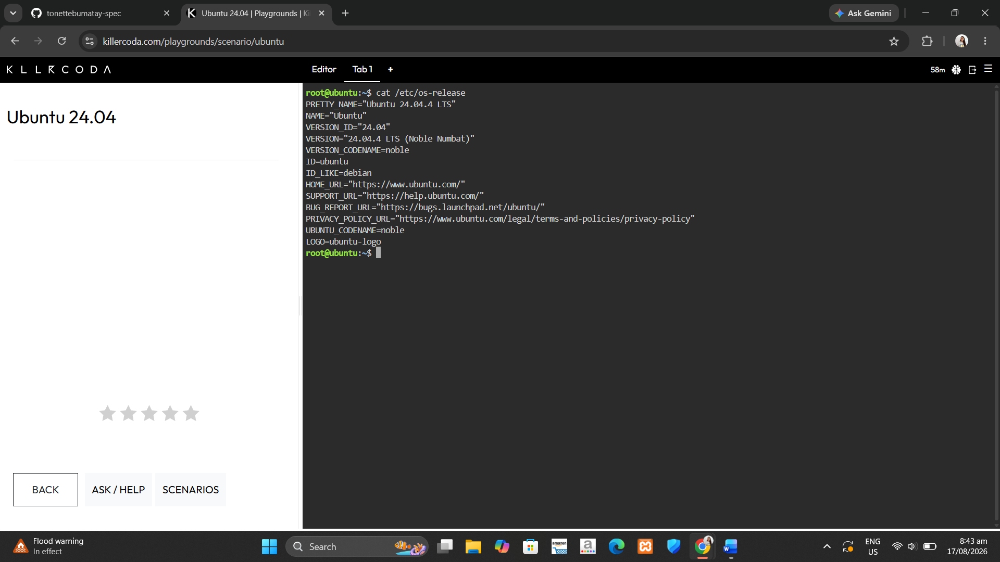
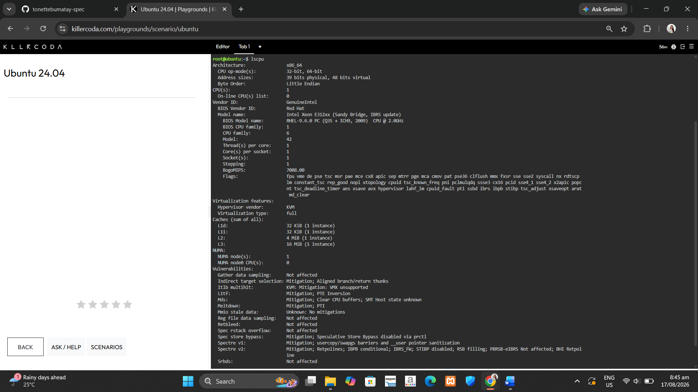
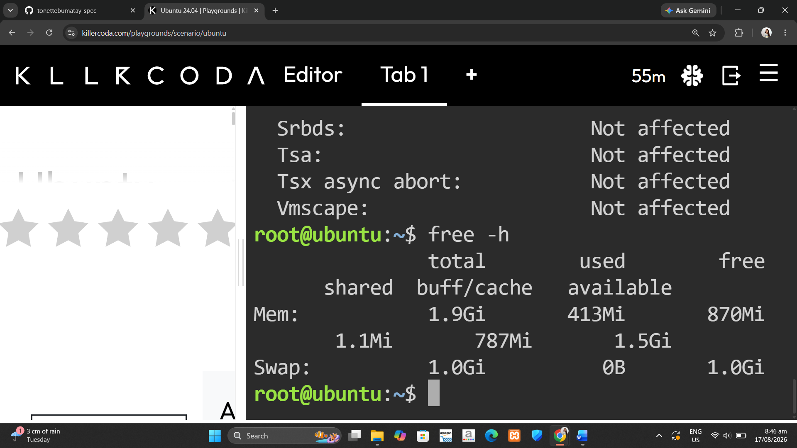
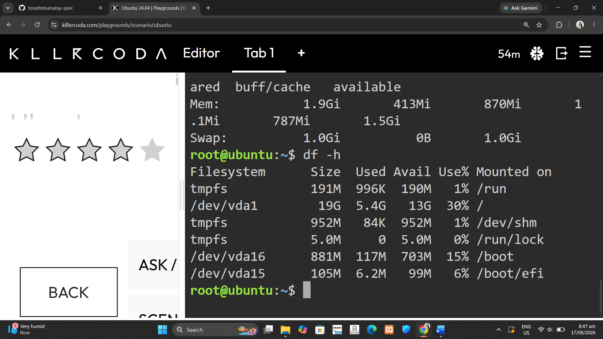

## Checkpoint 7 – Linux Investigation

### Linux Commands Output

I used KillerCoda to investigate a Linux server and found the following information:

**1. Operating System:**

**2. CPU Information:**

**3. Memory (RAM):**

**4. Disk Space:**

### Cloud Migration Analysis

If this Linux server were migrated to the cloud, it could be hosted using virtual machine services from each provider:

- **AWS:** Amazon EC2
- **Azure:** Azure Virtual Machines
- **GCP:** Compute Engine
