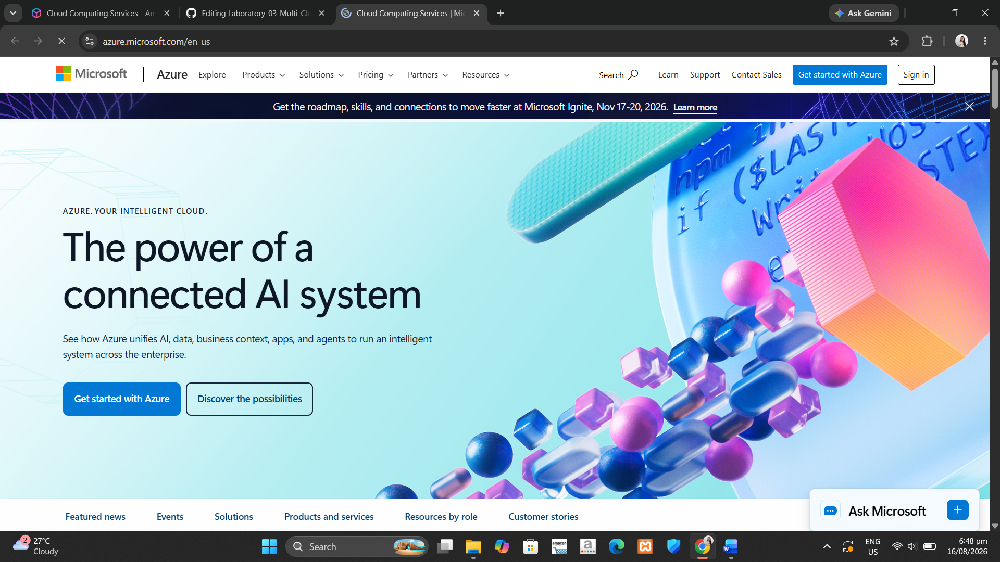

# Azure Research

## Brief Overview
Microsoft Azure is a cloud platform that provides services for building, deploying, and managing applications through Microsoft-managed data centers. It offers flexibility, scalability, and integrates natively with Microsoft technologies.

## Global Infrastructure
Azure has 60+ regions worldwide, making it the most globally distributed cloud provider.

## Cloud Management Console
Azure Portal – a web-based interface for managing Azure resources.

## Four Core Services

### Compute
- Azure Virtual Machines
- Azure Functions (serverless)

### Storage
- Azure Blob Storage
- Azure Files

### Networking
- Azure Virtual Network (VNet)
- Load Balancer

### Identity
- Azure Active Directory (Entra ID)

## Three Advantages
1. Seamless integration with Microsoft ecosystem (Microsoft 365, Active Directory, Windows Server)
2. Strong enterprise governance and compliance
3. Best hybrid cloud capabilities

## Typical Enterprise Use Cases
- Organizations using Microsoft technologies
- Hybrid cloud deployments
- Enterprise applications

## Screenshot

