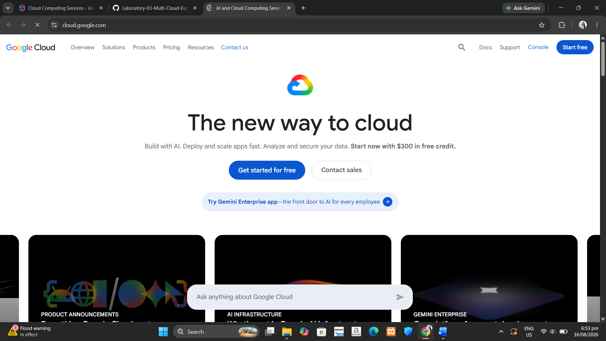

# Google Cloud Platform (GCP) Research

## Brief Overview
Google Cloud Platform (GCP) offers compute, storage, networking, data analytics, AI/ML, and developer services across a global backbone. GCP emphasizes software-defined networking, managed Kubernetes, and data/AI services.

## Global Infrastructure
GCP has 40+ regions worldwide, built on Google's private global network backbone.

## Cloud Management Console
Google Cloud Console – a web-based interface for managing GCP resources.

## Four Core Services

### Compute
- Compute Engine (VMs)
- Google Kubernetes Engine (GKE)

### Storage
- Cloud Storage (object storage)
- Persistent Disk

### Networking
- VPC
- Cloud Load Balancing
- Cloud CDN

### Identity
- IAM with service accounts and roles

## Three Advantages
1. Best-in-class Kubernetes (GKE) and BigQuery for data analytics
2. Strongest in AI and machine learning
3. Most transparent and cost-effective pricing

## Typical Enterprise Use Cases
- AI/ML workloads
- Data analytics and big data
- Container-native applications

## Screenshot

